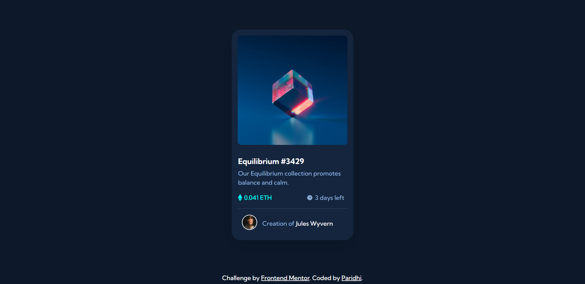

# Frontend Mentor - NFT preview card component solution

This is a solution to the [NFT preview card component challenge on Frontend Mentor](https://www.frontendmentor.io/challenges/nft-preview-card-component-SbdUL_w0U).

## Table of contents

- [Overview](#overview)
  - [The challenge](#the-challenge)
  - [Screenshots](#screenshots)
  - [Links](#links)
- [Built with](#built-with)
- [Author](#author)

## Overview

### The challenge

Users should be able to:

- View the optimal layout depending on their device's screen size
- See hover states for interactive elements

### Screenshots

### Links

- Solution URL:
- Live Site URL: https://paridhi3.github.io/NFT-Preview-Card-Component/

## Built with

- Semantic HTML5 markup
- CSS custom properties
- Bootstrap Card

## Author

- Website - //
- Frontend Mentor - [@paridhi3](https://www.frontendmentor.io/profile/paridhi3)
- Twitter - [@wittywimp](https://twitter.com/wittywimp)
